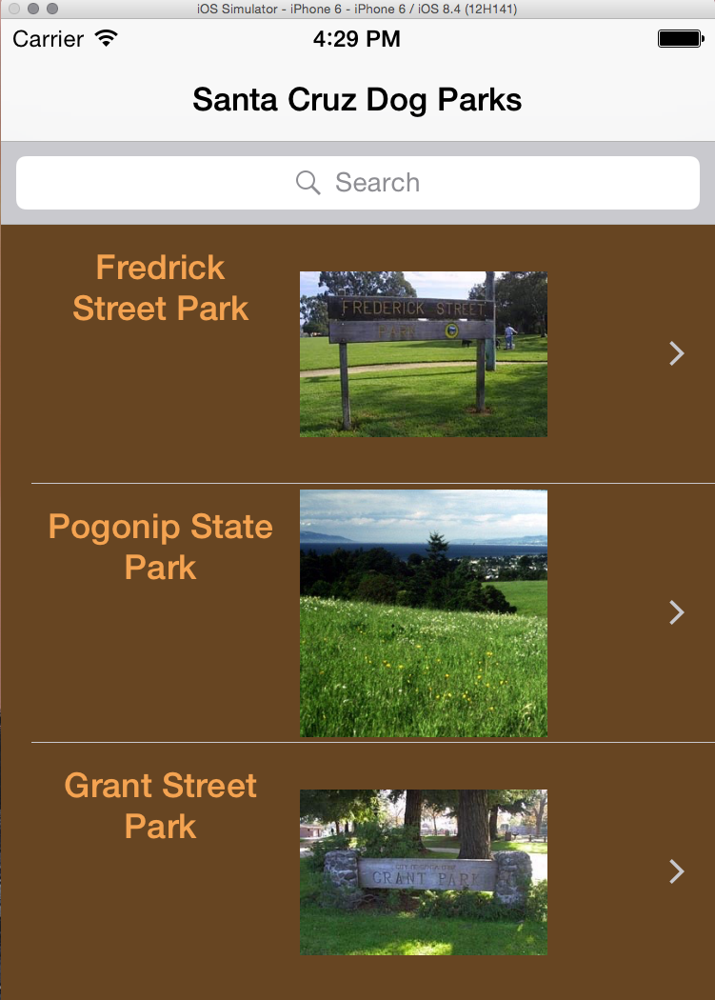
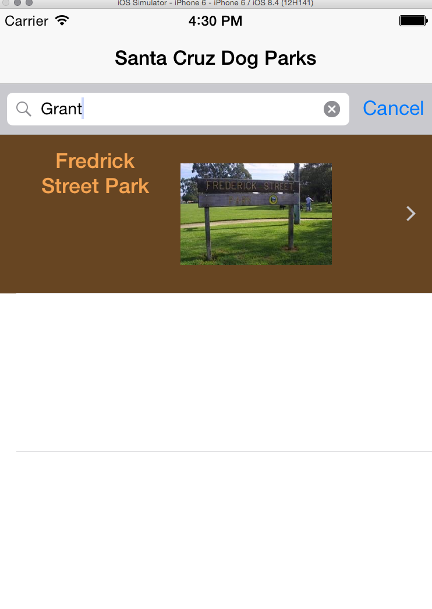

# DogParks
This app lists the dogparks of Santa Cruz County.  The data was obtained from
the county website. 

The app opens in a page that lists all the parks. The search Bar at the top will
search the list for your park.

Here is search bar function:

The right arrow on the cell opens a new view
that gives detailed information.

The tab bar at the bottom takes you to a new view that introduces the authors,
Brian Fiala and myself.

Some of the programming elements:

Persistent static data is taken in from a CSV file that is scanned into a
dictionary then loaded into objects.  The objects are held in core data and the
data persists until after the device is turned off. 

The DogParkObject has 4 attributes that are kept in the CoreData Entity of the
same name.
